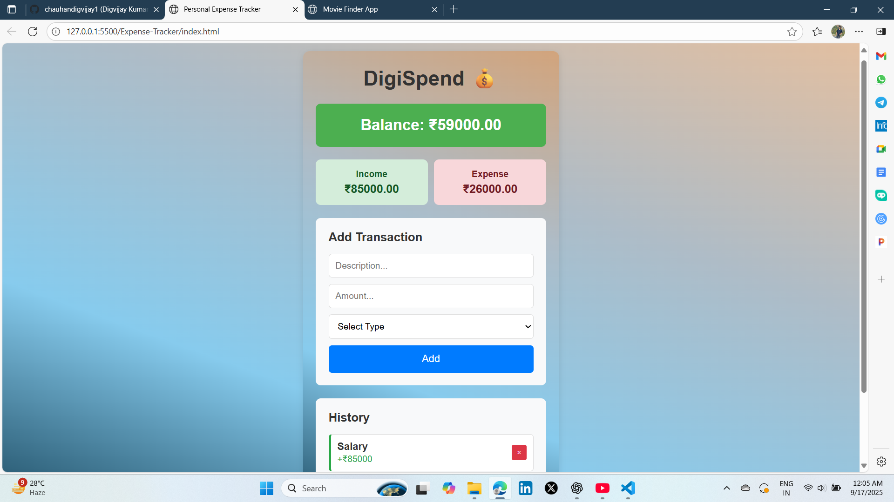
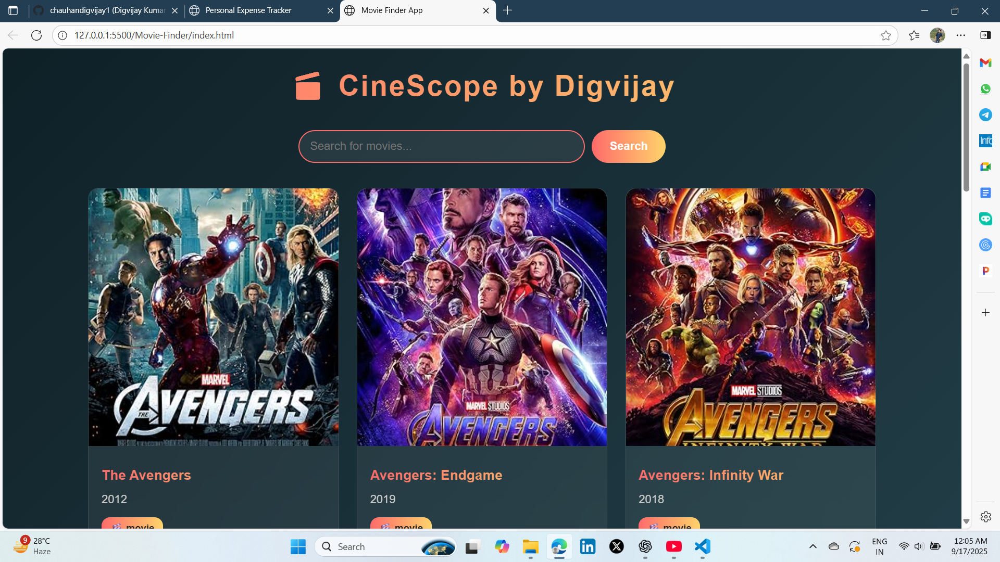
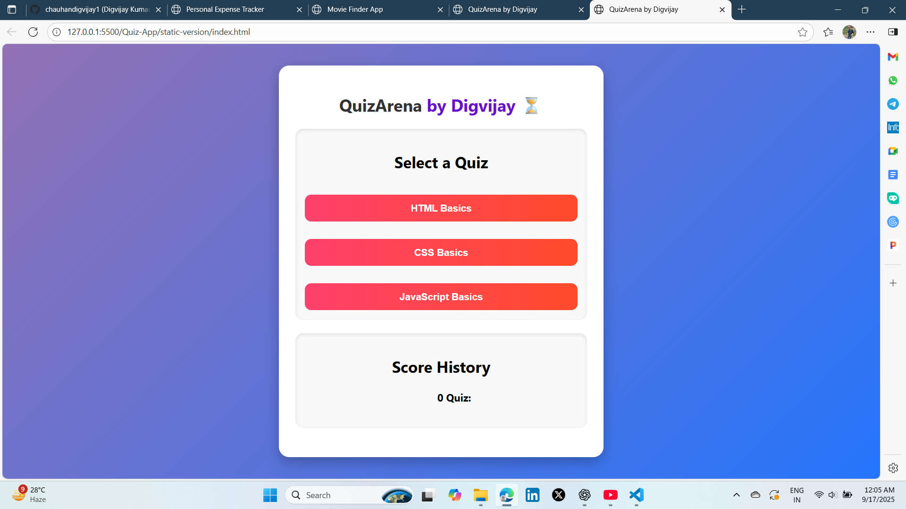
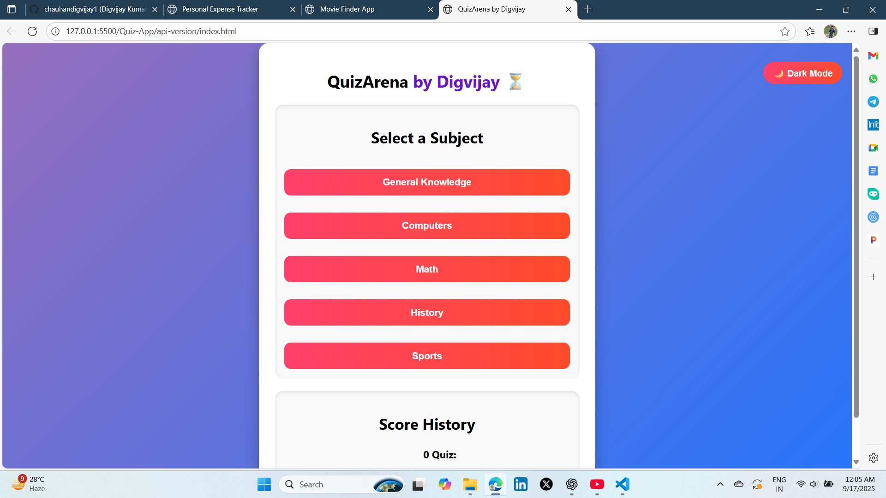

# 🚀 JavaScript Projects Collection by Digvijay Kumar Singh  

This repository contains my **JavaScript projects** built as part of my learning journey in **HTML5, CSS3, and JavaScript (ES6+)**.  
Each project demonstrates different skills – from DOM manipulation to API integration to building interactive apps.  

These projects are deployed live and can be viewed directly 👇  

---

## 📂 Projects

### 1. 💰 Expense Tracker  
- **Type:** Utility Project  
- **Tech Stack:** HTML, CSS, JavaScript (LocalStorage + DOM)  
- **Features:**  
  - Add and remove expenses  
  - Persistent data with LocalStorage  
  - Clean and responsive UI  
- **Live Demo:** [Expense Tracker](https://fcc-expense-tracker.netlify.app/)  
- **Screenshot:**  
  

---

### 2. 🎬 Movie Finder  
- **Type:** API Integration Project  
- **Tech Stack:** HTML, CSS, JavaScript (Fetch API, OMDB API)  
- **Features:**  
  - Search movies by title  
  - Fetch real-time data from OMDB API  
  - Movie posters, release year, and details shown dynamically  
- **Live Demo:** [Movie Finder](https://fcc-movie-finder.netlify.app/)  
- **Screenshot:**  
  

---

### 3. ❓ Quiz App (Static Version)  
- **Type:** Interactive App (Static Data)  
- **Tech Stack:** HTML, CSS, JavaScript (DOM updates)  
- **Features:**  
  - Multiple choice questions stored locally  
  - Score calculation  
  - Timer support (optional upgrade)  
- **Live Demo:** [Static Quiz App](https://fcc-quiz-app-static.netlify.app/)  
- **Screenshot:**  
  

---

### 4. 🌐 Quiz App (API Version)  
- **Type:** Interactive App (API Integration)  
- **Tech Stack:** HTML, CSS, JavaScript (Fetch API, Open Trivia API)  
- **Features:**  
  - Fetches questions dynamically from Trivia API  
  - Displays new questions each time  
  - Score updates in real-time  
- **Live Demo:** [API Quiz App](https://fcc-quiz-app-api.netlify.app/)  
- **Screenshot:**  
  

---

## 🛠️ Tech Stack Used  
- **Languages:** HTML5, CSS3, JavaScript (ES6+)  
- **Concepts Covered:**  
  - DOM Manipulation  
  - LocalStorage  
  - Fetch API  
  - Event Handling  
  - Responsive Design  
- **Deployment:** Netlify  
- **Version Control:** Git & GitHub  

---

## 📌 How to Run Locally  

1. Clone the repo:

   ```bash
   git clone https://github.com/chauhandigvijay1/javascript
   ```

2. Navigate to the project folder:

   ```bash
   cd javascript
   ```

3. Open any project folder, for example:

   ```bash
   cd Expense-Tracker
   ```

4. Open `index.html` in your browser (just double-click or use Live Server in VS Code).

---

## 🤝 Contributing

Contributions are always welcome! 🚀
If you have suggestions for improvements, new features, or bug fixes:

1. **Fork** the repository
2. **Create** a new branch (`git checkout -b feature-name`)
3. **Commit** your changes (`git commit -m "Added feature XYZ"`)
4. **Push** to the branch (`git push origin feature-name`)
5. **Open** a Pull Request

---

## 🔗 Connect with Me

🧑‍💻 [LinkedIn](https://www.linkedin.com/in/digvijaykumarsingh)  
💻 [GitHub](https://github.com/chauhandigvijay1)  
📧 chauhandigvijay669@gmail.com

---

## ⭐ Support

If you like this repository or found it helpful, consider giving it a **star ⭐** on GitHub.
Your support motivates me to build more cool projects! 💡🔥

---

Stay tuned for updates! 🚀

   ```bash
   git clone https://github.com/your-username/javascript-projects.git
